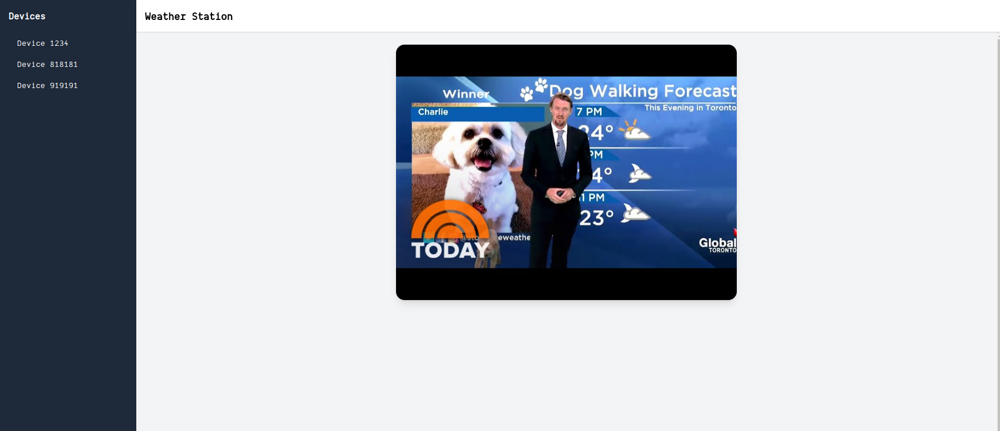
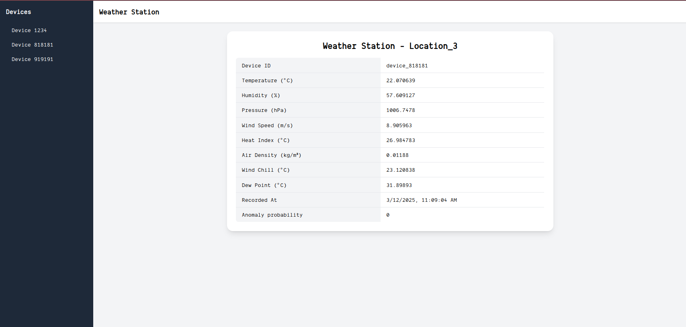

# Assignment Overview

### Objective:
Build a service to ingest and process sensor data in real-time, compute relevant metrics, detect anomalies, and visualize the processed data on a frontend dashboard.

---

### 1. Data Ingestion Service:

**Ingest Data from Sensor**:
- Implement a service that receives sensor data via an HTTP API on port `3030` (`POST /ingest` endpoint).
- The data should include the following parameters:
  - **device_id**: String (ID of the device)
  - **temperature**: Float (Temperature reading)
  - **humidity**: Float (Humidity percentage)
  - **pressure**: Float (Pressure reading)
  - **wind_speed**: Float (Wind speed reading)
  - **location**: String (Location of the sensor)
  - **timestamp**: Integer (Timestamp when the data was recorded)

- For each data entry:
  1. **Compute metrics**:
     - **Heat Index**
     - **Air Density**
     - **Wind Chill**
     - **Dew Point**
     - **Anomaly Probability**

  2. **Anomaly Detection**:
     - Implement a method to detect anomalies based on temperature readings, using a threshold value.

  3. Store the processed data, computed metrics, and anomaly status in the database.

---

### 2. Data Schema Design:

The database schema should store the following fields:

- **device_id**: String (ID of the device)
- **temperature**: Float (Temperature reading)
- **humidity**: Float (Humidity percentage)
- **pressure**: Float (Pressure reading)
- **wind_speed**: Float (Wind speed reading)
- **heat_index**: Float (Computed heat index)
- **air_density**: Float (Computed air density)
- **wind_chill**: Float (Computed wind chill)
- **dew_point**: Float (Computed dew point)
- **location**: String (Location of the sensor)
- **recorded_at**: Timestamp (Time when the data was recorded)
- **anomaly_prob**: Float (Probability that temperature obtained was real)

You would find an example in [init.sql](./server/clickhouse/init/init.sql). Feel free to modify it if you need to. `Clickhouse` is the database chosen for the assignment.
It is already part of the docker compose, no need to configure it. Refer to [docker-compose](./docker-compose.yml) for more info.

---

### 3. Realtime Data Visualization (Frontend):

Implement a frontend to visualize the real-time data, focusing on **Displaying Real-Time Sensor Data**, a dashboard that shows the incoming sensor data with real-time updates. You're tasked with:
- Implement a frontend dashboard to display and visualize the device data, users can reach the view selecting a device on the sidebar.
- Ensure real-time updates of sensor data on the dashboard every 10 seconds.
- Implement api for retrieving current data

Project is already setup on [client](./client/).



Your goal is implement device data view.



---

### 4. Algorithms

The following algorithms should be implemented:
1. **Anomaly Detection:**
```
threshold = 3

function detectAnomaly(temperature):
    anomalies = 0
    for i = 1 to 1,000,000:
        simulatedTemp = temperature + random number between -5 and 5
        if absolute difference between simulatedTemp and temperature > threshold:
            anomalies += 1
    return anomalies / 1,000,000
```
2. **Dew point calculation**
```
function calculateDewPoint(temperature, humidity):
    a = 17.27
    b = 237.7
    alpha = ((a * temperature) / (b + temperature)) + log(humidity / 100)
    return (b * alpha) / (a - alpha)
```
3. **Air Density Calculation**
```
function calculateAirDensity(pressure, temperature):
    return pressure / (287.05 * (temperature + 273.15))
```
4. **Wind Chill Calculation**
```
function calculateWindChill(temperature, windSpeed):
    if windSpeed > 4.8:
        return 13.12 + 0.6215 * temperature - 11.37 * windSpeed^0.16 + 0.3965 * temperature * windSpeed^0.16
    else:
        return temperature
```

---
### 5. Environment provided
Docker compose with data generation service, clickhouse and react application starter. Data generation service mimics data sent from real devices realtime.

In order to run the application, use

```sh
# run all services
docker compose up

# or

# individual services
docker compose up clickhouse
docker compose up device
docker compose up react-app

```

For react app, you can also jump to `client` folder and run instead of docker

```
npm install
npm run dev
```

Device service sends fake data to `http://sensor-ingestion:3030/ingest`, being `sensor-ingestion` the service host in `app_network`. Feel free to modify [docker-compose](./docker-compose.yml) device service `TARGET_URL` with your ingestion service endpoint.

---
### Things we will evaluate
1. Decoupling for high demand
2. You can use any programming language for the server, however, using `nodejs`, `php` or `java` is a plus.

---
### Bonus Question
> Not to implement, just to write it down.

A new feature just has been requested by our clients. They want to be able to check the average temperature for location, last hour and last day. How would you approach the feature?
